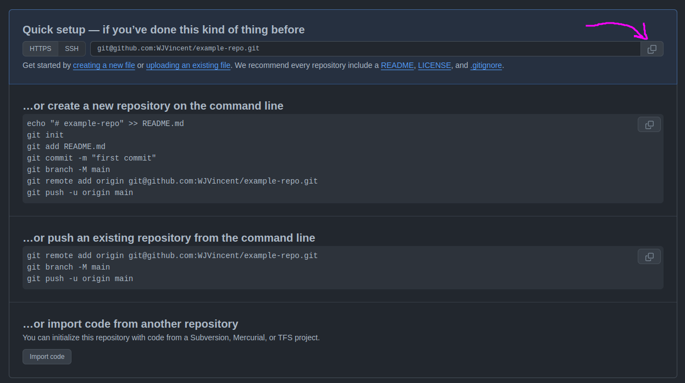
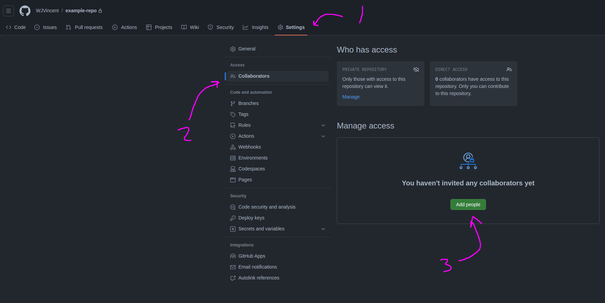

# Git Pairing Flow

Don't start the setup process until both you and your pair are in your breakout room and have decided on your initial roles. Setup should be as collaborative as the rest of your pairing.

Every project should have its own individual repository. Nested git repo's will ruin your day!

Make sure you are running commands in the correct directory. Always run `ls` before running any command. This will save you a massive amount of headaches!

## Setup

### Setup for Initial Driver

#### 1. Create a new repo on Github

- Click the new button to start creating a new repo

- Fill out the form
    - Select yourself as the owner
    - give the repo a name
    - make it a private repo
    - Don't fill anything else out

#### 2. Connect and Push your project up to that repo

- If you used `git clone` to download the project, remove the `.git` folder with `rm -rf .git`
    - If you used tiged, skip this and go right to the init step below
- Initialize your project as a git repo `git init`
- Stage the working directory `git add .`
- Commit the stages changes `git commit -m "initial commit"`
- Add the remote from your github repo `git remote add origin {your-url}`
- Run the initial push `git push -u origin main`
    - After this first push, which connects the branch to github, you can just run `git push` to push changes to github

#### 3. Give your pair access to your new repo

- Add your pair as a collaborator to the repository by github username

### Setup for Initial Navigator

#### 1. Accept invitation to repo

## Swapping Roles

### Driver -> Navigator

#### 1. Stage Your Changed Files

`git add .`

#### 2. Commit Your Staged Files

`git commit -m "commit message"`

#### 3. Push Your Committed Files

`git push`

### Navigator -> Driver

#### 1. Pull the latest changes

`git pull`